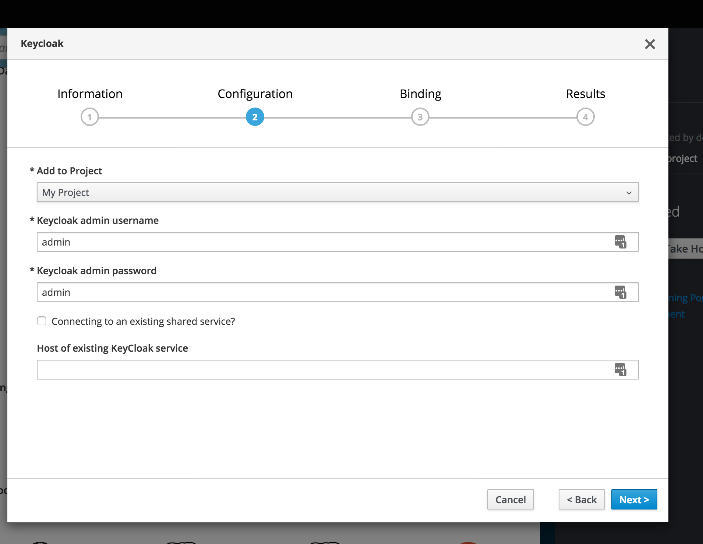

# Abstract

When a service is suitable for sharing across namespaces and already deployed and available in another namespace, the APB for deploying those services should be programmed to re-use the service that is available rather than deploying another instance of it.

## Terms

- APB ([ansible playbook bundle](https://docs.openshift.org/latest/apb_devel/index.html))
- Shared Service: A service that may be across multiple namespaces
- System Resources: CPU or memory
- Namespace / Project: These refer to the same thing and may be used interchangably.
- apb.yml: ([APB spec file](https://docs.openshift.org/latest/apb_devel/writing/reference.html#apb-devel-writing-ref-spec)) Configures the inputs passed to an APB prior to deployment.

## Problem Description

Some of the services used in the development of a mobile application can require quite a lot of system resources which could turn into a factor that limits adoption of the Mobile Platform.

For example, if multiple developers are building a product which requires an Authentication Service, and they do not have the resources available to run a seperate instance of an Authentication Service in each developers project, there is currently no convenient way for all of these developers to develop their application using a single shared Authentication Service.

## Goals

- A convenient way for the developer to tell the platform about an existing deployment of the service he is about to deploy.
- The APB for a shared service automatically connecting to the shared service in another namespace, using the provided details.
- The APB for a shared service automatically configuring the shared service in another namespace and exposing the configuration details to the current namespace.

## Non-Goals

- The platform intelligently discovering and connecting to services that are running in seperate namespaces.
- The platform intelligently discovering and suggesting services to connect to.

## Proposed Solution

For services that are suited to being shared services (such as KeyCloak), we can make a change the apb.yml, allowing the developer to specify connection details for an already existing instance of the service this APB would otherwise deploy.

Example:

In this example, if the `Host of existing KeyCloak service` were left empty then a new service would be installed. However if this field were populated the APB would connect to the host with the provided auth details and then complete the APB as usual using this existing shared Service.

Once the shared service has been configured via the APB, the APB will then expose these configuration details to the current namespace in it's usual manner (i.e. config-map, secret, etc).

Should the APB be unable to connect to the supplied Shared Service details then the APB should exit with a failure status and report the problem in a way that will make trouble-shooting as convenient as possible for the developer.

Most, if not all, of this work will be executed inside the APB logic for services deemed suitable for conversion to a Shared Service. Possible candidates for this work are listed below, but this list is not final:
- KeyCloak
- UPS
- Build Farm

### Potential Difficulties

#### Cluttered Configuration Screen
The form for configuring the shared service via the APB could start looking quite busy with the extra inputs, an ideal solution to this would be fields that display conditionally with a check-box like "This is a shared service" which would hide the deploy options and instead display the shared service options, at the moment this is not possible, but having contacted the ASB team they have informed that it is on their roadmap.

#### Unclear Failures
Currently, when an APB fails to deploy, the error can be quite hard to find (you need to look at the APB pod logs in the APB specific namespace - which might not be visible to the currently logged in user)