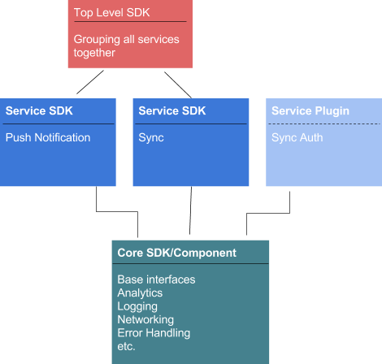

# Abstract

This document outlines a proposal for mobile service SDK 

## Goals

Main goal for this document is to provide full overview of the future mobile SDK.
Document outlines a proposal for mobile service SDK's and all related elements.
Proposal basing on industry standards for building multi service SDK's. 

### Primary Goals

Provide top level architecture and delivery model for mobile SDK's.

### Non Goals

Describe individual service SDK's:
This will be done in separate proposals.

## Problem Description

Selecting best architecture used to build mobile SDK . 

### Elements to include

1. Git hosting

How to host SDK's in git.
Single repository for platform or service etc.?

2. SDK distribution to end users
Platform specific way of distributing packages
Can be maven, cocoapods etc. 

3. Documentation for SDK
Api documentation and top level SDK documentation. 

4. Architecture
How to allow users to interact with SDK.
Allow flexibility on network layer etc.
How to prevent users from including large binary when they need single service.
 
5. Adding common services and addons for all services
Functionalities like network handling, logging, monitoring and audit, error handling, analytics.

6. Developer tooling 
How to build or provide (plugins, extensions) to service

7. Size constraints 
For example method limit on android

8. Platform language
Supporting multiple flavours (languages per platform) - Swift vs ObjectiveC. Java vs Kotlin etc.

## Proposed Solution

Modular SDK For SDK that can contain multiple non related services 

### Overview

Modular architecture is a software design technique that emphasizes separating the functionality of a program into independent, interchangeable modules, such that each contains everything necessary to execute only one aspect of the desired functionality.

Modular architecture is well known as practice for the server side development, but it can be also applied when building mobile SDK. In modular mobile SDK, code can be divided into separate packages that can be used separately by specific platform package manager. Each package depends on core package that needs to be added as separate dependency.

This technique applies especially for large SDK’s that will implement clients for multiple not strictly correlated services. 

Having top level SDK allows developers to provide fluent api (different forms of the top level api that can be swapped and extended). Modular architecture also enforces good programming patterns. Networking, Logging etc. are loosely coupled with the service which allows developers to swap implementations with their own favorite network or logging library.

#### Advantages of modular SDK

- Easy to maintain as common elements can be extracted to base layer
- Easy to scale while providing uniform way of integration with services
- Simplicity when maintaining external dependencies
- Possibility to have multiple variants/extensions to the services without including them into source code.
- Modularity helps to separate common elements with all services
- More flexible (SDK can be distributed both as bundle or as single services)
- More centralized approach for services 
- Simplicity of releases - out of the box when working with tools like lerna etc.
- Simplicity of analytics and other cross service components.
- Simplified documentation (assuming that packages are in mono repository)

####  Possible side effects

- Grouping services together may make it harder to contribute to the individual services.
- Modular SDK’s are easy to maintain in platform specific mono repositories, which may not be acceptable in some cases.

### General requirements 

SDK should relay on reactive (RX*) api used for internal communication between SDK components. On each platform can be implemented using RXJS, RXJava etc.

#### Git hosting

For most efficient automation single repository per platform is recommended.
Repository will contain all related services source code, core module, deployment automation, documentation etc.

### Platform specific requirements

#### Cordova

### Distribution

Packages in common.js format (standard for cordova)
NPM @aerogear organization will be used to host packages.
Lerna.js for deployment automation.

## Documentation

Generated from source code + separate folder with examples.

## Language

TypeScript as base language for SDK. 

#### Android

TODO 
Integrate: https://github.com/aerogear/proposals/pull/2 

#### IOS

TODO 
Cocoapods/Swift Package Manager
ObjectiveC core
Documentation: https://github.com/realm/jazzy