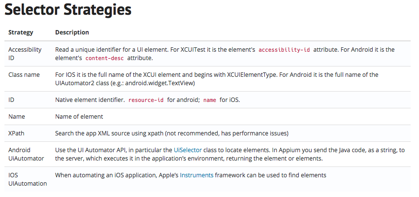

## Appium 
Appium is a cross platform UI testing tool for mobile applications running on 
either android or iOS devices.  It can be used to test native applications, 
hybrid applications like Cordova and Xamarin, and web app testing through mobile 
device browsers.  One of major points of the Appium philosophy is to avoid time 
consuming processes like compiling to run UI tests.

### Appium Locator/Selector Strategies

https://appium.io/docs/en/commands/element/find-elements/#selector-strategies

The picture above shows the available selector strategies to appium in order to 
locate elements in a mobile application. Note that some of the descriptions also 
shows the required attributes in for both Android and iOS applications.  It can 
be a problem when using cross platform tools such as Cordova to use these 
selectors and the webview context should be used.  It is important to note that 
some clients do not offer all of the selector strategies as shown in the table 
above.

## Appium Clients
Appium uses a client-server architecture that interacts with the emulator or browser 
when running UI test.  The Appium client is used by the test code to create a session 
with the Appium server and will send the instructions to the server which will then 
interact with the emulator, simulator or connected device to perform the UI tests.

One of the most important sections of code when writing tests is the specification of 
‘desired capabilities’.  These ‘desired capabilities’ instruct the server as to the 
type of session required and various capabilities which will be available to the 
server during the test runs.  For example, they can be used to block pop-ups or 
security warnings in browsers or to check if an expected version of Android or iOS 
is installed on the emulator, simulator or connected device before running the tests 
(If the version is different the server will throw an error in this case and exit 
from the test).

### Important Considerations When Selecting an Appium client

* Can the appium client handle your use cases and edge cases?
                           
* Is there enough locator strategies available to the client?

* If there is a limited number of locator strategies, are you 
willing to put in extra effort to label all elements with 
preferred selectors?

### Java Client
The java client is one of main Appium libraries used for testing with Appium and 
is frequently kept up to date, and new features tend to land quicker than in other 
clients.  It can continue testing in situations that require switching between 
applications without needing to change context, such as redirecting to login in the 
browser and back to the application, and also contains support for cross platform 
java-based page objects using annotations.  All selectors specified in the Appium 
documentation are available to this library. 

### Webdriverio
The Webdriverio client is a subset of the Webdriverio library for UI testing.  Like 
the Java-client it can easily handle switching between applications, however it does 
not have as many selectors available to it.  Accessibility ID, the recently added 
Class Name and XPath are the selectors native to the driver, while Android UIAutomator’s 
and iOS UIAutomation framework can also be used.

### WD.js
The WD.js library is maintained by Adam Christian and like the Webdriverio client is a 
subset of the WD.js library for UI testing.  While there are more selector strategies 
available to it than there is contained in Webdriverio, it cannot handle switching between 
application and the browser.
