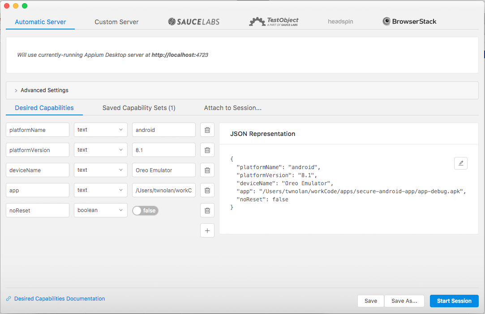
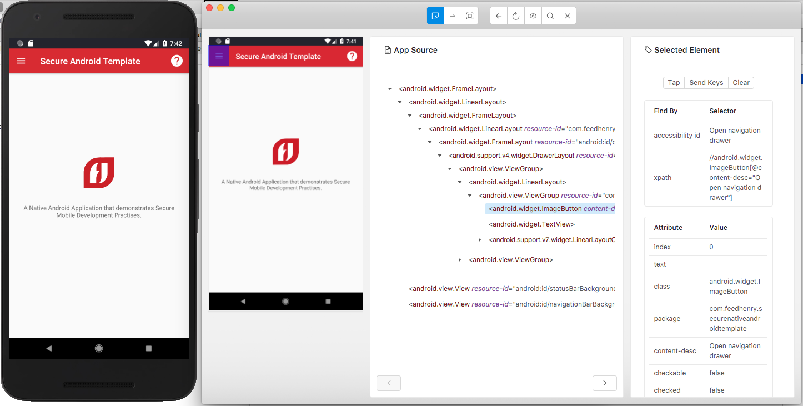
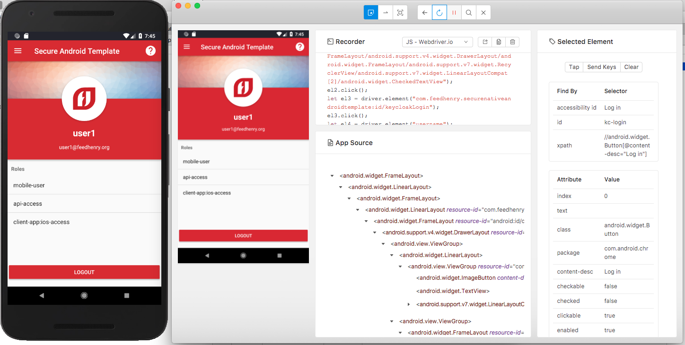
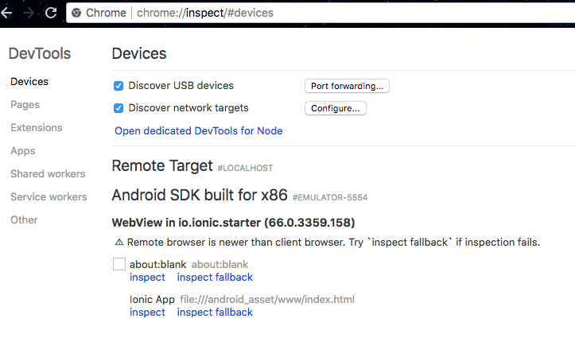
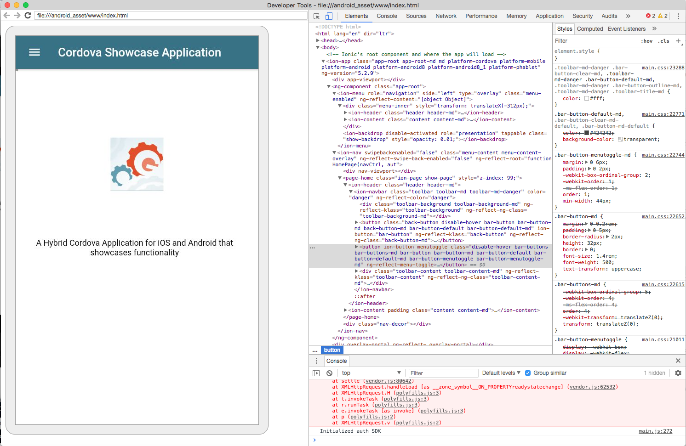

## Finding Appium Selectors

### Appium Inspector

When a developer installs “Appium Desktop” on their machine, not only are they installing the server 
and GUI tooling to configure and control it, they also install a tool called appium inspector which 
can be used to interrogate applications to find selectors.  Once the server is started, clicking on 
the “Start Inspector Session” button in the application will bring up the session configuration 
screen.  

“Desired Capabilities” are required to be entered into the configuration settings before starting 
the inspector, and they can also be saved for use in future sessions with the same application. 
The mandatory capabilities are “platformName”, “deviceName” and “app”, which provide information 
such as Android or iOS device, the name of the emulator or simulator, and the path to the binary 
of the application to test.  A useful non-mandatory selector is “platform version” which ensures 
that the session will not start if device platform version does not match the version you intend 
to test on. 

The following two images show an example of how to setup an Appium Inspector session, and what it 
looks like when the session is running.

 

### Code Recording in Appium Inspector

As shown above it is possible to record session interactions using Appium Inspector in order to 
generate test code.  This is available for a number of languages, but the code produced is 
unrefined and should not be used as the test code.  The recorded code can be found under the
recorder section at the center of the screen.

Note: Before using Appium Inspector for checking elements in Cordova applications on Android it 
is advisable to install chromedriver, and update the chrome browser inside the emulator to a 
version compatible with the chromedriver version installed.

### Chrome Dev Tools

Chrome dev tools can be used as an alternative to Appium Inspector when trying to find selectors to 
use for apps like the cordova showcase app. Enter “chrome://inspect” into the chrome browser, any 
running emulators with apps they are running will be displayed as shown below.  

Click "inspect" under “Ionic App” to open up a new window that contains the Dev Tools and a window 
that can also control the emulator.

