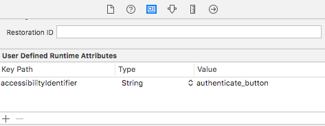
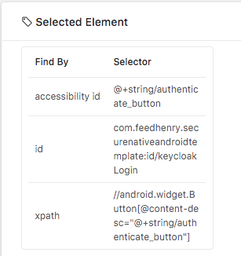
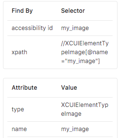

## The importance of UI Selectors
There are various application engineering decisions that will affect the decision that can 
be made when choosing an Appium client. For example, if engineering decides to add “preferred” 
selectors such as ‘accessibility Id’s’ or ‘ID’s’ to the application that will be tested, the 
main benefit will be a test suite that is more stable as discussed in the next section. Also 
a library with less selectors such as Webdriverio could be used to create the tests.  If 
engineering decides not to take this path then, the test suite will likely be more flaky, and 
the best client to use is the Java-client which has a wide range of selectors.


### Prefered and Unadvisable Selectors

Selectors such as ‘AccessibilityId’ or ‘ID’ are generally prefered when using 
Appium testing. Due to the facts that they are relatively short, they generally 
provide a indicator of what an element is used for, can be independently targeted 
from parent elements, and will not break if the order of elements, or parents of 
elements, on a UI page are modified. 

Absolute xpaths tend to be more brittle an slower than other forms of selectors 
and indeed Appium inspector will give warnings about the possible performance 
issues of using an xpath when it is the only selector available.  The reasons for 
such issues are that absolute xpaths contain class information or information from 
parents that could change depending on the development of an application.  This 
can be more prominent for hybrid apps or in browser testing where xpaths can become
 much longer. 

It is possible to improve the rigidness and performance of xpaths in test by using 
relative xpaths that are shorter and more flexible.  For example, a standard xpath 
selector from an Android application such as:

    "//Android.widget.TextView[@text='My Messages']"

Can be shortened to:

	"//TextView[@text='My Messages']"

The only problem with a relative xpath compared to an accessibilityId, id, or name 
is that when using one like the example above there may also a dependency on the 
text value of the page.  If the text on the page is changed, then it will be required 
to change the selector in the test as well.   While this is an improvement still, one 
risk with using relative xpaths is over time, as developers change, the knowledge of 
the importance of relative xpaths in providing benefits to the test suite can be lost. 
This can result in inefficient and more brittle xpaths, as produced by tools such as 
“Appium Inspector”, being used and affecting test suite performance and reliability. 

## Examples of Adding Selectors to Applications

### iOS (AccessibilityId Example)

By default, if an ‘accessibilityId’ is not defined for an element, an iOS application will 
dynamically set the ‘accessibilitityId’ of an element to the value of the element. This is not 
ideal when testing for any elements that display information that will be dynamically created, 
such as a username for a user, or possibly with elements such as toggle switches or checkboxes 
where the value is updated after being clicked.

For iOS the ‘accessibilityId’ can be added to a UI component in two ways. When viewing the 
storyboards in Xcode, to add an ‘accessibilityId’, firstly select the element, then open the 
identity inspector tab. Under the ‘User Defined Runtime Attributes’, add a new Key Path called 
‘accessibilityIdentifier’, set the Type to ‘String’, and set the Value to the desired name of 
the new selector.




The second way of adding an ‘accessibilityId’ to a UI element is to do so through Swift code.  
This can be done by setting the ‘accessibilityIdentifier’ attribute of a UI element as shown 
below.

```swift
if (indexPath.row == 0) {
    fieldNameLabel.text = "Name"
    fieldValueLabel.text = self.currentUser!.fullName
    fieldValueLabel.accessibilityIdentifier = "username"
} else {
    fieldName.text = "Email"
    fieldValueLabel.text = self.currentUser!.email
    fieldValueLabel.accessibilityIdentifier = "email"
}
```

### Android (AccessibilityId Example)
Unlike iOS Android does not dynamically assign any values to the AccesibilityId.  Instead if 
the developer wishes to use AccessibilityId for testing purposes, it can be added to Android 
apps by setting the ‘contentDescription’ attribute either in the xml UI specifications or 
through the use of code by using the ‘setContentDescription’ method of a UI element.  


```xml
<Button 
    android:id="@+id/keycloakLogin"
    android:contentDescription="@+string/authenticate_button"
    style="@style/widget.AppCompat.Button.Colored"
    android:layout_width="match_parent"
    android:layout_height="wrap_content"
    android:text="Authenticate"
    android:layout_marginBottom="15dp"
    android:layout_alignParentBottom="true"
    android:layout_alignParentStart="true" />
```




### Xamarin (AutomationId Example)
Xamarin elements have a unique attribute called AutomationId, which can be used to set UI selectors 
across both iOS and Android platforms.  This can be set in either the XAML code or in the C# backend 
code.  

```cs
// C# Code
var button = new Button{
    Text = "Authenticate"
    AutomationId = "authenticate_button"
}
```


```xml
<ic:CircleImage AutomationId="my_image" 
    WidthRequest="100" 
    HeightRequest="100"
    Aspect="AspectFill" />
```




### Cordova (id Example)

Unlike Android, iOS and Xamarin applications with can be tested using Appiums native context, webview
context should be used to test Cordova/Ionic applications.  When testing applications using the webview
context, web based targeting selectors should be used.  For example in the Java-client the full Selenium
WebDriver API can be used, while in the Nodejs Webdriverio library the standard webdriverio selector 
targeting methods can be used.  Note that in both of these libraries, the standard web based selector or
locator strategies are not available when using the native context.

In order to prepare Appium to test a Cordova/Ionic application in the desied capabilities section,
`autoWebview` should be included and set to `true`.  This will immediatley prepare the test to run in a
webview context.  Note, the native view selector or locator stategies will now be unavailable.

The following is an example of using standard id attributes in an ionic based application.  With these
ids specified, when running in webview context, Appium can use the standard web app based selectors for
targeting these elements.  

```html
<ion-card>

    <ion-card-content style="text-align: center">
        <ion-item>
            <ion-avatar item-start>
            
            </ion-avatar>
            <h3 id='fullName'>{{profile.firstName}} {{profile.lastName}}</h3>
            <p>Full Name</p>
        </ion-item>
        <ion-item>
            <h3 id='email'> {{profile.email}} </h3>
            <p> Email </p>
        </ion-item>
        <ion-item>
            <h3 id='username'> {{profile.username}} </h3>
            <p> Username </p>
        </ion-item>
    </ion-card-content>
</ion-card>
```

One dependency when running under webview, is the compatibility of the version of chromedriver that is
being used with Appium.  A version is shipped with the Appium, however this is not always compatible
with the chrome browser running in the Android device.  In this case an error can be thrown when 
trying to switch to the webview context.  In order to avoid this problem, a new version of Chromedriver
can be downloaded and installed on the system and then the Appium server can be instructed to use this
chromedriver via the "Desired Capabilities".  

Note that Chromedriver versions are only compatibile with a few versions of the Chrome browser on the 
devices.  When installing a Chromedriver it is important either to match the compatibility of the version 
of Chromedriver and its compatible Chrome browser version, or to install the latest version of Chromedriver, 
and then update the Chrome browser on the device to the latest version.