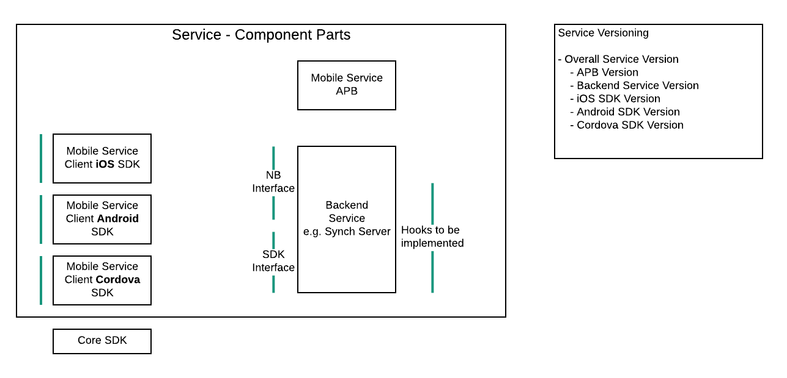

# Versioning of Components and their APIs

## Introduction

Versioning across system components and their public APIs needs to be considered.

## Problem Description

The initial discussions which led to this proposal were around how to handle versions of APIs of the different components. The discussions quickly followed into an overall discusion on how the different components will be versioned. There are a number of problems which need to be addressed with this proposal;
* How do we make it easy for the Mobile App Developer, that he/she does not get bogged down in a version checking ritual
  * What version matrices do a Mobile App Developer have to check? 
* At what level are versions kept?
* When changes are made to differnt components, what is the impact on dependent components?
* Do we have rules which define compatibility? 
 

## Asumptions
Listing of assumptions on how other parts of the system will work, as the proposal may base some decisions on these assumptions.

1. The the Mobile Application business logic written by the Mobile App Developer will have to import a specific version of the SDK they want. this implies that a Mobile Device can have multiple versions of each SDK.
2. An assumption is that the OpenShift Catalog will, in the future, provide versions associated with each Service.

  
## Proposed Solution
This solution looks to simplify as much as possible 'versioning' for the primary target audience which is the Mobile Application Developer (MAD). The first thing is to consider at what level does the MAD interact with the system.

* One of the first tasks a MAD will perform is to go to the Service Catalog and provision the Mobile Services he/she requires. What is worth noting here is the level which the MAD is working at now is 'service level'.

* The next task which the MAD will perform is to integrate two services via the Mobile CLI. Again the level in which the MAD is working at is 'service level'. At this point, a lot of the work on the backend is complete, the MAD can proceed to develop his/her app on the client side.

* Next task for the MAD is to include the IDE plugin. This probably is optional.

* Next is for the MAD to import the SDK which is needed for the service he/she is using. The SDK being a component of the Service. At this point the MAD is working at an 'SDK level'.

    Based on the above, we are proposing an overarching **Mobile Service version**. This overall version will encompass a number of sub components defined further on.

The intention is that the MAD only have to deal with the Mobile Service version, to simplify their experience. 

* Once they import a Service version, they get the latest SDK for the platform they are working on
* The only time they will need to upgrade their own code (i.e. their business logic) is if they are upgrading to a new MAJOR release of the Service, i.e. the public interface of the Service potentially has changed.
* Because the MAD will be responsible for service integrations he/she will have to be aware of the compatiability between services.

   **Example Service Integration Martix**
        | Synch         | Keycloak         | Compatibility  |
        | :------------:|:----------------:| :-------------:|
        | v1.3.\*       | v1.4, v1.5, v1.6 | Compatiable    |
        | v2.1          | v2.\*, v3.1, v3.2| Compatiable    |
The above matrix needs to exist somewhere and be available to the MAD.

The MAD will use the Mobile CLI for service integrations and possibly also to get config to add to his/her project. The Mobile CLI's version will most likely be associated with the version of OpenShift.

### Mobile Service Components

* Mobile Service Name and Overall Version (Major.Minor only, no patch)
  * Backend Component and its API (Major.Minor.Patch)
  * Mobile Client Service SDK (Android) and its API (Major.Minor.Patch)
  * Mobile Client Service SDK (iOS) and its API (Major.Minor.Patch)
  * Mobile Client Service SDK (Cordova) and its API (Major.Minor.Patch)
  * Mobile Service APB (Major.Minor.Patch)

  

  

We need a set of rules which can be used to enforce compliance across these sub components.

### Proposed Rules to be applied
1. **Lockstep across all Mobile Service Components**

   Major and Minor versions only.
   If any one of the Mobile Client components step Major or Minor version, the other component of the Mobile Service versions step also and the overall Mobile Service Version also steps

   The knock on impact of this rule is that all components step in unison, from 1.2 to 1.3, even though there were no changes in the other componets.

   **Value provided by this rule**
   For the MAD, if he/she has a version of a Service, the same version of the sub components are available also.

   Note; you can still patch any of the sub components, with out impacting the other versions.

   Wei; should we step the patch version of the overall service version?

2. **Mobile Client Service SDK compatibility with Backend Component**
   
   For the Client Service SDK to be compatiable with the backend service;

   * Client SDK Major Version **==** Backend Major Version **&&** Client SDK Minor Version **<=** Backend Minor Version
   * Patch version can be ignored

   **Example**
        | Client SDK    | Backend       | Compatibility  |
        | :------------:|:-------------:| :-------------:|
        | v1.3          | v1.4          | Compatiable    |
        | v1.3.2        | v1.3          | Compatiable    |
        | v2.1          | v1.4          | InCompatible   |
        | v1.6          | v1.4          | InCompatible   |

   Wei; Is this rule defunct now? Maybe not; a MAD may upgrade the Service from 1.4 to 1.5 but may not change his/her import (it imported 1.4 in the business logic and their code will still work.

3. **A public API breaking change results in a step in the MAJOR version**
   
   If there is a breaking change to any of the public APIs of the Service, then there must be a step in the MAJOR version of all components.

### Benetits of Solution
- we try to work at a service level which is the level at which our primary users work at.
- we try to simplify the experience for the primary user

### Limitations of Solution
- we step components even if they don't change

## Additional Considerations
- the relationship between the Core SDK and its version with the Service SDKs!
