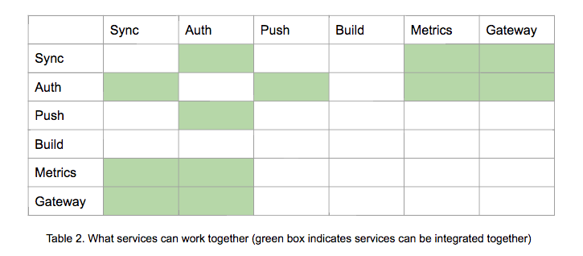
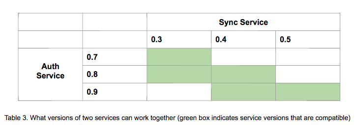
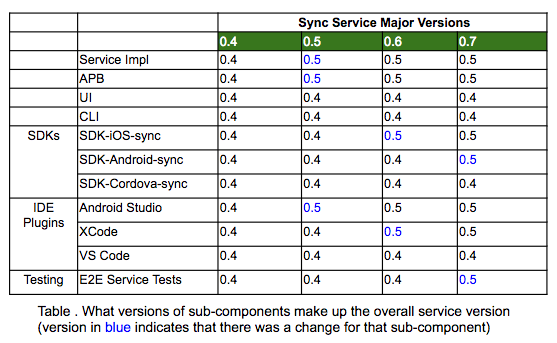
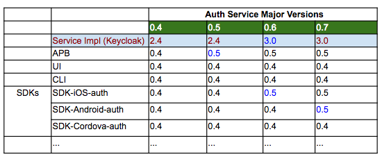

# Versioning of Components

## Introduction

Upstream versioning across system components and their public APIs needs to be considered.

## Problem Description

Using AeroGear means being aware of and interacting with various components of the system. There needs to be an agreed process in place in how we version these components such that an end user can easily identify what components work together and what versions of the components are compatiable. 

* What version matrices does a Mobile App Developer need to understand the system? 
* At what level are versions kept?
* When changes are made to different components, what is the impact on dependent components?
* How do the QE team know what to test, with respect to what version of what component should work together?
 

## Asumptions
Listing of assumptions on how other parts of the system will work, as the proposal may base some decisions on these assumptions.

* An assumption is that the OpenShift Catalog will, in the future, publish versions associated with each Service. It won't act on them, just display the version.

  
## Proposed Solution
A Mobile Service (e.g. Synch, Push, Auth) is made up of a number of sub-components, namely;

* Mobile Service
  * Backend Component
  * Mobile Service APB
  * Mobile Client Service SDK (Android)
  * Mobile Client Service SDK (iOS)
  * Mobile Client Service SDK (Cordova)
  * UI - Service may or may not have a UI component
  * CLI - Service may or may not have a specific aspect of the CLI dedicated to its functionality
  * IDE Plugins - Service may or may not have a specific aspect of an IDE Plugin dedicated to its functionality (TBD)
    * Android Studio
    * VS Code
    * XCode
  * E2E Service Tests - suite of tests for the version of the Mobile Service

All of the sub-components above will have their own version.

### Introduce an overall **Mobile Service version**
This version is like a snapshot in time of everything (all specific sub-components) which makes up that Mobile Service. See table below for overall version of Synch 1.3.

|               | Synch 1.3        |
|  -----------  |  --------------  |
| APB                  | v1.0 |
| Backend Serice       | v1.2 |
| SDK-Android          | v1.1 |
| SDK-iOS              | v1.0 |
| SDK-Cordova          | v1.0 |
| IDE-AndroidStudio    | v1.2 |
| IDE-VSCode           | v1.0 |
| IDE-XCode            | v1.0 |
| UI                   | v1.0 |
| CLI                  | v1.0 |
| E2E Service Tests    | v1.0 |

The reason for introducing this is two fold;
* to encapsulate all of the sub components and their versions such that developers can easily identify what versions of the sub-components make up that version of the service and therefore work together.
* to have some high level entity which has a version when considering Mobile Service integrations (i.e. what Mobile Services can work together and what versions of these services work together)

This table of each overall version of the Mobile Serivce and its set of sub-components must be produced and made availble through the docs. This table of information is essential for developers.

### Produce Mobile Service Integration Matrices
Once a developer knows what makes up a Mobile Service, their next task may be to integrate that Mobile Service with another Service. Therefore we propose the following two tables:

**Mobile Service Integration Matrix**

There needs to be a matrix which a develoepr can use to see what Mobile Services work together. See example below.

**Mobile Service Integration Version Compatiability Matrix**

Once a developer knows what services work together, then they need to know what versions of those services work together, they need a version compatiability matrix. See Example below;

### Process
With regard to the versioning process what are the necessary changes/points to note;

* If a sub-component of a service changes
  * That sub-component is stepped and the overall Service version is stepped
  * The other sub-components of the Service are not stepped

  

* Release Notes should be produced at a Mobile Service level
  * You can see what sub-components changed.
* You can patch a sub-component, e.g. SDK-Android-Sync 0.4.0 -> 0.4.1
  * The patched component will need to be tested with other components within the service which it interacts with (i.e. its touch points)
  * Based on tests passing; the overall service version will not change, but the patch is compatible. SDK-Android-Sync 0.4.1 is compatible with Sync 0.4 and all its constituent components.
* If the Mobile Service which is being offered by AeroGear makes use of another standalone backend Service, the version of that Service must be represented
  * Keycloak Service is not under Mobile/Aerogear’s control but its a primary component of AeroGear's Auth Service. We package it along with an APB and SDKs. We need to highlight what version of Keycloak is being used inside our different versions of our Auth Service. See Example below;

  

### Releasing
All components can be released separately, but it may be worth considering the release of a Mobile Serice after every Sprint or second Sprint. In doing that you are producing a compatiable set of components which represents the service.

## Additional Considerations
- the relationship between the Core SDK and the Service SDKs from a version perspective! This relationship will need to be handled but the developer more than likley will not see the Core SDK or not have to worry about it.
- How much defensive functionality is developed around allowing or disallowing Mobile Service Integrations to be requested if we know that there will be compatiability issues.
  - this could be addressed in the IDE Plugin or the Mobile CLI. It possibly doesn't need to be addressed now but can be considered in the future.
- the following will most likely also need versions
  - Mobile Core (installer?)
     - the installer will point to the repo where the playbooks are installed, currently aerogear/playbooks
     - in downstream, it may point at a different organisation
  - MiniShift Plugin
  - Mobile App Representation (their APBs) - do they have a dependency on a Mobile Service, possibly CI/CD service? Worth considering